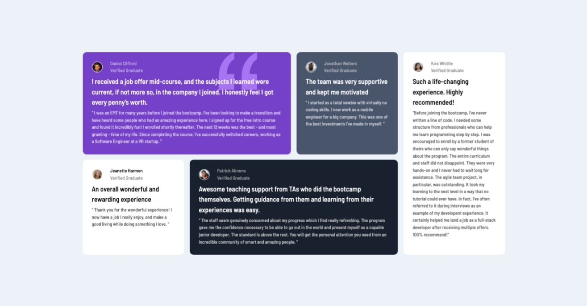
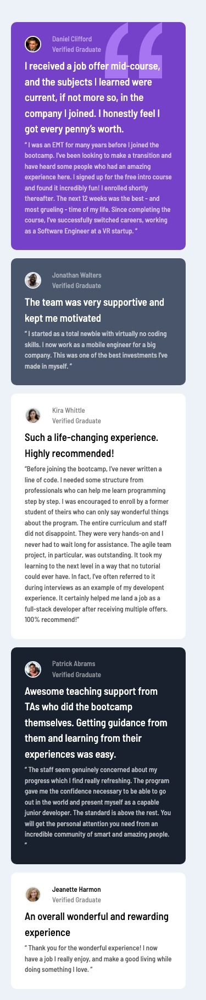

# Frontend Mentor - Testimonials grid section solution

This is a solution to the [Testimonials grid section challenge on Frontend Mentor](https://www.frontendmentor.io/challenges/testimonials-grid-section-Nnw6J7Un7). Frontend Mentor challenges help you improve your coding skills by building realistic projects. 

## Table of contents

- [Overview](#overview)
  - [The challenge](#the-challenge)
  - [Screenshot](#screenshot)
  - [Links](#links)
- [My process](#my-process)
  - [Built with](#built-with)
  - [What I learned](#what-i-learned)
  - [Useful resources](#useful-resources)
- [Author](#author)

**Note: Delete this note and update the table of contents based on what sections you keep.**

## Overview

### The challenge

Users should be able to:

- View the optimal layout for the site depending on their device's screen size

### Screenshot

### Links

- Solution URL: [Github](https://github.com/KevDCS/testimonial-grid.git)
- Live Site URL: [Netlify](https://dreamy-biscochitos-1e2afb.netlify.app/)

## My process

### Built with

- Semantic HTML5 markup
- CSS custom properties
- Flexbox
- CSS Grid
- Mobile-first workflow
- [Vite](https://vitejs.dev/) - Build Tool
- [Vue](https://cli.vuejs.org/) - JS library

### What I learned

I haven't used grid in a long time, and I had a hard time trying to make it responsive and arranging the cards. Also it took me a while to figure out how to make it responsive, cause I was setting the media queries right, but I had set the width and height, and that wasn't letting the items to adjust in lower resolutions.

Also I tried to use variables in CSS this time, just to get me use to use them, it's easier but I still need practice to know how to use them properly.

### Useful resources

- [CSS Tricks Grid Guide](https://css-tricks.com/snippets/css/complete-guide-grid/) - This is an amazing article which helped to remember a couple of things, and even when I know I know something, I still double-check it, it's the best guide. I'd recommend it to anyone still learning this concept.

## Author

- Frontend Mentor - [@KevDCS](https://www.frontendmentor.io/profile/kevdcs)
- Twitter - [@codosho](https://www.twitter.com/codosho)
